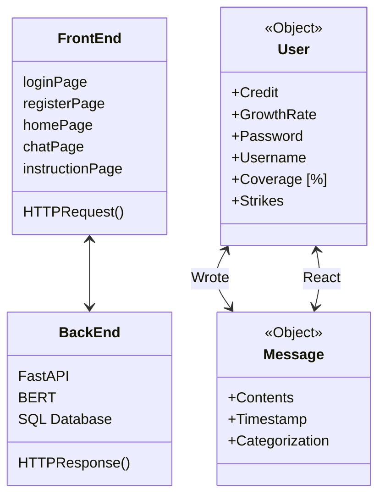
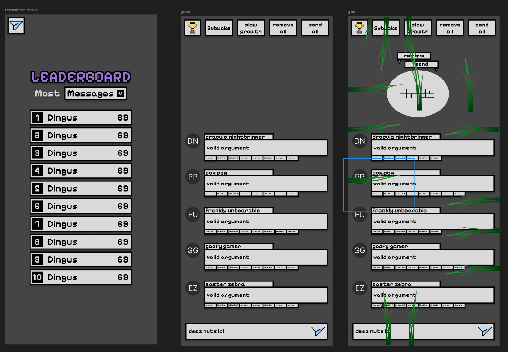

# .devHacks 

Our entry for the 2025 .DevHacks hackathon. We won the "Chaotic Evil Hack" award!

## Description

We were inspired by the joke that conputer science students spend too much time online, and need to go out and "touch grass". Your goal is to subvert societal expectations and continue interacting with your chronically online friends in our chatroom.

## Installation

Make sure you read the README.md of both the backend and the frontend.

## ER Diagram

## Tech Stack

Frontend: React, TypeScript, Vite, TailwindCSS, React-Query, React-Router, Axios, Zustand
Backend: Supabase (Postgres), FastAPI, Pydantic, BERT, PyTorch, Transformers, Uvicorn

## Figma Mockup

